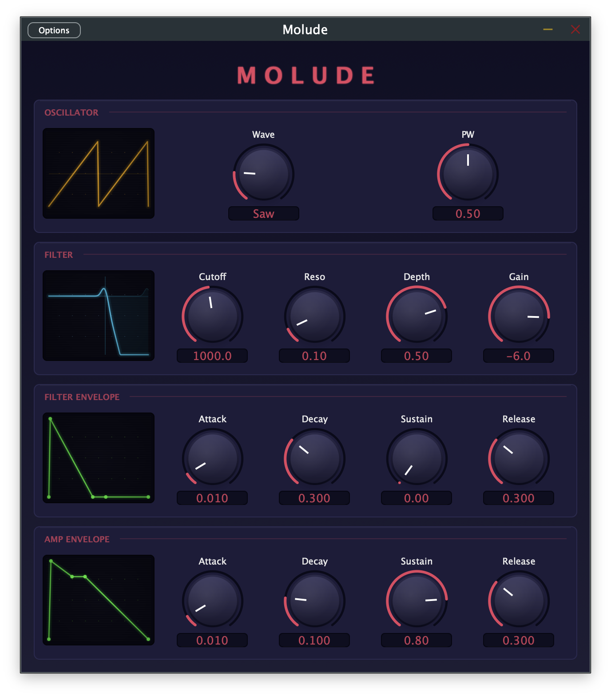

# Molude

A monophonic subtractive synthesizer plugin built with [JUCE](https://juce.com/).

Available as **VST3** (Windows, macOS, Linux), **AU** (macOS), and **Standalone**.



## Features

- **Oscillator** — Sine, Saw, Square, Triangle, Pulse, and Noise waveforms
- **Low-pass filter** — 24 dB/oct ladder filter with cutoff and resonance
- **Filter envelope** — Dedicated ADSR with bipolar depth control (-100% to +100%)
- **Amp envelope** — Standard ADSR for amplitude shaping
- **Master gain** — Output level control (-60 dB to +6 dB)
- **Custom GUI** — Dark theme with arc-based rotary knobs

## Building

### Prerequisites (all platforms)

- [CMake](https://cmake.org/) 3.25 or newer
- [Git](https://git-scm.com/)
- A C++17 compiler

### Clone

```bash
git clone --recurse-submodules https://github.com/Mancherel/molude.git
cd molude
```

If you already cloned without `--recurse-submodules`:

```bash
git submodule update --init
```

---

### macOS

**Requirements:** Xcode Command Line Tools (or full Xcode)

```bash
# Install CMake if needed
brew install cmake

# Build
cmake -B build -G "Unix Makefiles" -DCMAKE_BUILD_TYPE=Release
cmake --build build --config Release -j$(sysctl -n hw.ncpu)
```

**Output:**
| Format | Location |
|--------|----------|
| VST3 | `~/Library/Audio/Plug-Ins/VST3/Molude.vst3` |
| AU | `~/Library/Audio/Plug-Ins/Components/Molude.component` |
| Standalone | `build/Molude_artefacts/Release/Standalone/Molude.app` |

> **Note:** To auto-install built plugins to the system plugin folders, configure with `-DMOLUDE_COPY_PLUGIN_AFTER_BUILD=ON`. The default build keeps artefacts inside `build/`.

**Optional — Xcode project:**

```bash
cmake -B build-xcode -G Xcode
open build-xcode/Molude.xcodeproj
```

---

### Windows

**Requirements:** [Visual Studio 2022](https://visualstudio.microsoft.com/) with "Desktop development with C++" workload

```bash
# Install CMake if needed
winget install Kitware.CMake

# Build
cmake -B build -G "Visual Studio 17 2022" -A x64
cmake --build build --config Release
```

**Or use the included script:**

```
build-windows.bat
```

**Output:**
| Format | Location |
|--------|----------|
| VST3 | `build\Molude_artefacts\Release\VST3\Molude.vst3` |
| Standalone | `build\Molude_artefacts\Release\Standalone\Molude.exe` |

**Install the VST3:**

```
copy /r build\Molude_artefacts\Release\VST3\Molude.vst3 "C:\Program Files\Common Files\VST3\"
```

---

### Linux

**Requirements:** GCC/G++ and development libraries

```bash
# Ubuntu/Debian
sudo apt install cmake g++ libasound2-dev libfreetype-dev \
  libx11-dev libxrandr-dev libxcursor-dev libxinerama-dev \
  libwebkit2gtk-4.1-dev

# Build
cmake -B build -G "Unix Makefiles" -DCMAKE_BUILD_TYPE=Release
cmake --build build --config Release -j$(nproc)
```

**Or use the included script:**

```bash
./build-linux.sh
```

**Output:**
| Format | Location |
|--------|----------|
| VST3 | `build/Molude_artefacts/Release/VST3/Molude.vst3` |
| Standalone | `build/Molude_artefacts/Release/Standalone/Molude` |

**Install the VST3:**

```bash
mkdir -p ~/.vst3
cp -r build/Molude_artefacts/Release/VST3/Molude.vst3 ~/.vst3/
```

---

## Parameters

| Parameter | Range | Default | Description |
|-----------|-------|---------|-------------|
| Waveform | Sine, Saw, Square, Triangle, Pulse, Noise | Sine | Oscillator waveform |
| Cutoff | 20 Hz – 20 kHz | 1000 Hz | Filter cutoff frequency |
| Resonance | 0 – 100% | 10% | Filter resonance |
| Depth | -100% – +100% | 50% | Filter envelope modulation depth |
| Gain | -60 – +6 dB | -6 dB | Master output level |
| Filter Env | ADSR | 10ms / 300ms / 0% / 300ms | Filter envelope |
| Amp Env | ADSR | 10ms / 100ms / 80% / 300ms | Amplitude envelope |

## License

This project uses [JUCE](https://juce.com/) which is dual-licensed under the AGPLv3 and a commercial license. See [JUCE/LICENSE.md](JUCE/LICENSE.md) for details.
